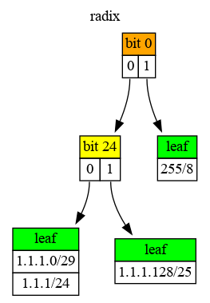

# Radix

[](https://github.com/hertogp/radix/actions/workflows/elixir.yml)
[](https://hex.pm/packages/radix)
[](https://hexdocs.pm/radix/)
[](https://github.com/hertogp/radix/commits/main)
[](https://github.com/hertogp/radix/blob/master/LICENSE.md)
[](https://hex.pm/packages/radix)

<!-- @MODULEDOC -->

A bitwise radix tree for prefix based matching on bitstring keys of any length.

`Radix` provides a [radix tree](https://en.wikipedia.org/wiki/Radix_tree) whose
radius is 2, has path-compression and no one-way branching.  Entries consist of
{key, value}-pairs whose insertion/deletion is always based on an exact
key-match. Retrieval can be either exact or based on a longest prefix match.


## Example

    iex> t = new()
    ...>     |> put(<<1, 1, 1>>, "1.1.1.0/24")
    ...>     |> put(<<1, 1, 1, 0::6>>, "1.1.1.0/30")
    ...>     |> put(<<1, 1, 1, 1::6>>, "1.1.1.4/30")
    ...>     |> put(<<1, 1, 1, 1::1>>, "1.1.1.128/25")
    ...>     |> put(<<255>>, "255/8")
    iex>
    iex> # longest prefix match
    iex> lookup(t, <<1, 1, 1, 255>>)
    {<<1, 1, 1, 1::1>>, "1.1.1.128/25"}
    iex>
    iex> # more specific matches (includes search key if present)
    iex> more(t, <<1, 1, 1>>)
    [
      {<<1, 1, 1, 1::size(6)>>, "1.1.1.4/30"},
      {<<1, 1, 1, 0::size(6)>>, "1.1.1.0/30"},
      {<<1, 1, 1>>, "1.1.1.0/24"},
      {<<1, 1, 1, 1::size(1)>>, "1.1.1.128/25"}
    ]
    iex> # less specific matches (includes search key if present)
    iex> less(t, <<1, 1, 1, 3>>)
    [
      {<<1, 1, 1, 0::size(6)>>, "1.1.1.0/30"},
      {<<1, 1, 1>>, "1.1.1.0/24"}
    ]
    iex> # exact match
    iex> get(t, <<1, 1, 1, 0::6>>)
    {<<1, 1, 1, 0::6>>, "1.1.1.0/30"}
    iex> get(t, <<2, 2, 2, 2>>)
    nil
    iex> pruner = fn
    ...>   {_k0, _k1, _v1, _k2, _v2} -> {:ok, "new parent"}
    ...>   {_k0, _v0, _k1, _v1, _k2, _v2} -> {:ok, "updated parent"}
    ...> end
    iex> keys(t)
    [
      <<1, 1, 1, 0::size(6)>>,
      <<1, 1, 1>>,
      <<1, 1, 1, 1::size(6)>>,
      <<1, 1, 1, 1::size(1)>>,
      <<255>>
    ]
    iex> prune(t, pruner)
    ...> |> keys()
    [
      <<1, 1, 1, 0::size(5)>>,
      <<1, 1, 1>>,
      <<1, 1, 1, 1::size(1)>>,
      <<255>>
    ]
    iex> prune(t, pruner)
    ...> |> dot()
    ...> |> (&File.write("assets/readme.dot", &1)).()


The radix tree above, after pruning, looks something like this:



The tree is represented by two types of nodes:
- *internal node*, as a `{bit, left, right}`-tuple, and
- *leaf node*, which is either `nil` or a non-empty list of `{key,value}`-pairs

The `bit` denotes the bit position to check in a key during a tree traversal,
where `0` means go `left` and `1` means go `right`.  A `bit` beyond a `key`'s
length is considered to be `0`.  Path-compression means not all bits are
checked during tree traversal, only those that differentiate the keys stored
below the current `internal` node.  Hence, branches are formed as keys with
different patterns are stored in the tree.

The `leaf` node can have a list of `{key, value}`-pairs where all longer keys
have all shorter keys as their prefix.  In other words, they all agree on the
bits that were checked to arrive at that node.  The `key` is stored alongside
the `value` since, due to path-compression, a final match is needed to ensure
a correct match.  Hence, retrieval functions return the `{key, value}`-pair,
rather than just the `value`, since the stored key is not always equal to the
given search key (e.g. when doing a longest prefix match).


Since binaries are bitstrings too, they work as well:

    iex> t = new([{"A.new", "new"}, {"A.newer", "newer"}, {"B.newest", "newest"}])
    iex> more(t, "A.") |> Enum.reverse()
    [{"A.new", "new"}, {"A.newer", "newer"}]
    #
    iex> lookup(t, "A.newest")
    {"A.new", "new"}
    #
    iex> more(t, "C.")
    []

<!-- @MODULEDOC -->

Note: if Radix is used only for `put`/`get` operations, using a regular map
is way faster.


## Installation

[Radix](https://hexdocs.pm/radix) can be installed by adding `radix` to your
list of dependencies in `mix.exs`:

```elixir
def deps do
  [
    {:radix, "~> 0.4.0"}
  ]
end
```

## Copyright and License

Copyright (c) 2021 hertogp

The source code is licensed under the [MIT License](./LICENSE.md).
